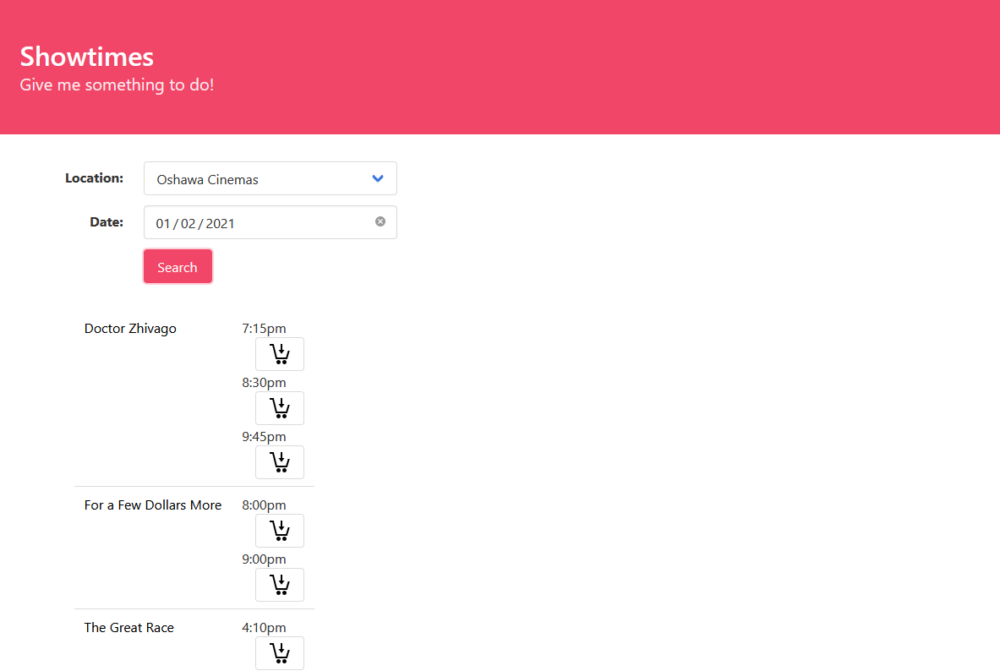

# Lab 07-10

The starter code for lab 07-10.


## Overview

Let's create a movie information website, which provides a list of showtimes, provides information about the movies, and allows users to purchase tickets online.

_**Note:** This lab is designed to take 4 weeks, and is divided into four parts.  Each of the four parts is worth the weight of one lab assignment (3% each).  It is recommended that you do the OMDB web service content in the first week, the client page for the showtimes in the second week, the web service (server side) for the showtimes in the third week, and finally the ticket purchase system in the fourth week._


## Part 1 - An OMDB Client

In the first part of this lab, we'll create a simple web page showing details about movies.  This data will come from the OMDB web service, which you can find out more about [here](https://www.omdbapi.com).  To use this service, you need to sign up for a free API key (you can use a throw-away E-Mail, if you wish, when doing so).

The usage of the OMDB API will follow the following URL format:

`http://www.omdbapi.com/?i=${id}&apikey=${apiKey}`

The appearance and the data displayed for this section should match Figure 1.  The movie details will be displayed in a form-like structure, but it will not be editable.  This structure, and all layout for this lab, will use the Bulma CSS framework (or another CSS framework, if you prefer).

For the IMDB `Rating` field, instead of displaying as a value between `0.0` and `10.0`, you will represent the floor of the rating, and show that number of trophy icons.  This trophy icon is provided (`images/trophy.png`) .

The movie whose details are to be shown will be hard-coded into a JavaScript variable (`imdb_id`), which will store the IMDB id (e.g. `tt0059113`).  This variable will eventually be set dynamically, when this part is integrated into the larger application.


_Figure 1 - The movie info page_


## Part 2 - A Showtimes Client

In the second part of this lab, you will continue designing the user interface for the application, which will also use a JSON-based API for its data.  At this point, we will just use a static JSON file (provided in `showtimes.json`).  You will need to serve all of the files for this assignment from a web server.  It is recommended that you put all of the client files (including those from part 1) into a `public` folder within a new Node.js project, and use the following simple code to serve all of this content:

```
app.use(express.static('public'));
```

The `showtimes.html` file will initially only show a simple form for selecting a date, a location, and a `Search` button.  Modify the showtimes page to provide a dropdown for the location (which you can pre-populate with hard-coded entries matching your sample data) and a date picker.  The page and form will look like that in figure 2.  You can use any date picker that you want, but an example that works well with Bulma can be found here:
- [https://bulma-calendar.onrender.com/](https://bulma-calendar.onrender.com/)


_Figure 2 - The showtimes page showing the search form_

When clicked, the JSON data will be queried, passing the `location_id` and `selected_date` as `GET` arguments.  Since the JSON file is currently a static file, the results will always be the same.  In the next part, we will replace this static file with a web service API of our own, which will generate these showtimes.  The page will automatically generate a list of films, along with the showtimes for each.  The output should look like that in figure 3.


_Figure 3 - The updated showtimes page showing the results_

The film title will be a link that, when clicked, will show the movie details from part 1.  Both will appear together on the same page, so this may require some re-structuring and layout.  The result, showing after a film has been clicked, should look like figure 4.


_Figure 4 - The updated showtimes page showing the movie details of a selected movie_

_**Note**:  For the purposes of this part of the lab assignment, use a static file (`showtimes.json`) for the content.  The content will be made dynamic in the next part._


## Part 3 - The Showtimes Web Service Endpoint

In this part of the lab, you will write a web service API which serves showtimes from a MongoDB database.  The API will take, as arguments, a date (`selected_date`, a string of the form `YYYY/MM/DD`) and a location (`location_id`, an integer, e.g. `1` for `Oshawa Cinemas`), and will return a list of showtimes using the same JSON format used in part 2, such that the showtimes listed are for the specified date (matching the `date` field in the database), and the specified location (matching the `location` field in the database, using exact match comparison).  The output can contain extra fields, if you want, but it must be compatible with your code from part 2.  This data will be served from a URI of `/showtimes_api`.

The MongoDB collection (called `showtimes`) will contain documents similar to the following:

```
{
    "id": "tt0059742",
    "title": "The Sound of Music",
    "location": "1",
    "date": "2021/01/01",
    "times": [
        "7:15pm",
        "8:40pm"
    ]
}
```

_**Note**:  The locations will be selected using a `select` element which has location names (e.g. `Oshawa Cinemas`) and location IDs (e.g. `value` attribute of `1`)  The location name is for the user's benefit, but we'll use the location ID in our database._

_**Note**:  MongoDB includes a GUI client, called MongoDB Compass, which makes it easier to import data.   You can modify the existing `showtimes.json` file to include the new fields, and import it (even importing it multiple times, slightly altered, with different locations and dates)._

The code for this part will go into a separate file, `showtimes_model.js`, which will be imported and used by the main Node.js file.  

_**Note**:  You will need to modify the code from part 2 to use `/showtimes_api` instead of `/showtimes.json`._

_**Note**:  You can assume that there will be duplicate documents in the database, even for the same film, representing each date and each location._


## Part 4 - A Ticket Purchasing System

In the showtimes page, beside each showtime, create a form that will take the user to a ticket buying form.  This form will contain only one visible component, a button (`buyButton`) that shows only the `buy.png` image ().  The form will look like that in figure 5.  



_Figure 5 - The updated showtimes page showing the `buyButton`_

The form will also have a number of hidden fields so that the ticket buying form is pre-populated with the correct data.  These hidden fields are:

- `movie_id` - the IMDB movie id for the current movie
- `movie_title` - the title of the current movie 
- `location_id` - the id for the currently selected location
- `location` - the name of the currently selected location
- `selected_date` - the currently selected date
- `start_time` - the current start time

When the `buyButton` is clicked, this data will be sent (using the `GET` protocol) to an endpoint `/buyTickets` defined in Node.js.  This page will use a Pug view to display the following fields (passed as `GET` parameters to this endpoint):
- `movie_title` - the title of the current movie 
- `location` - the name of the currently selected location
- `selected_date` - the currently selected date
- `start_time` - the current start time

This purchase form will look like that in figure 6.


_Figure 6 - The ticket purchase form_

The form will also include the following fields, included as hidden fields:
- `movie_id` - the IMDB movie id for the current movie
- `location_id` - the id for the currently selected location

The form will also include a button (`buyButton`), which will send this data (using `POST`) to another endpoint (with the same URI `/buyTickets`), which will insert the data into an SQLite database.

You will put all SQLite code into a separate module (`model/purchases_model.js`), which will define and export the following functions:
- `getAllPurchases()` - returns a list of every purchase in the `purchases` table in the database
- `addPurchase()` - takes data for every field (except for the primary key, `purchaseId`) and will insert that data as a new row in the table `purchases`
- `deletePurchase()` - takes an id, and deletes the purchase corresponding to that id (this function is not presently used)

After the data has been successfully been inserted into the `purchases` table in the SQLite database, you will show a confirmation page (another Pug view), which will show a confirmation number (which will be generated by the `uuid` package), and a QR code corresponding to that confirmation number (which will be provided by the `qrcode` package).  This page will look like figure 7.


_Figure 7 - The ticket purchase confirmation page_

Sample code for using the `qrcode` package is given, below:

```
QRCode.toFile('/path/to/file.png', 'text to be encoded', {
    width: 500
}, function (err) {
    if (err) throw err
});
```

_**Note:**  As an alternative to Pug, it is also possible to use Vue.js, React, Angular, or another templating engine.  As usual, if you choose to use one of these alternatives, you are accepting the responsibility of environment setup, support, and learning the framework on your own._


## Need Extra Challenge?

If this was too easy, and you want some additional practice, try out one or more of the following extra features for increased learning:

1. Re-organize the database in part 3 to use two separate collections.  One (`films`) will store the movie details, and the other (`showtimes`) will only related the `id` with the date, showtimes, and location.  The functionality will be the same, but the database will be more realistic.
2. Create a page that allows administrators to add additional films (with or without the image) to the database.
3. After tickets have been ordered, in part 4, send the user a confirmation E-Mail with their confirmation number and totals.


## Getting Help

If you run into difficulty, you may wish to check out some of the following resources:

- https://developer.mozilla.org/en-US/docs/Learn/HTML - Tutorials and reference documentation for HTML by the Mozilla Developer Network (MDN)
- https://developer.mozilla.org/en-US/docs/Learn/CSS - Tutorials and reference documentation for CSS by the Mozilla Developer Network (MDN)
- https://developer.mozilla.org/en-US/docs/Web/JavaScript - Tutorials and reference documentation for JavaScript by the Mozilla Developer Network (MDN)
- https://www.w3schools.com/ - Tutorials for HTML, CSS, JavaScript, and jQuery by the W3Schools group
- https://learn.jquery.com/ - Tutorial for jQuery, by the jQuery team
- https://nodejs.org/en/docs/guides/ - A guide for Node.js, by the Node team.
- https://www.npmjs.com/package/mongoose - A Node.js package for working with a MongoDB database
- https://www.npmjs.com/package/sqlite3 - A Node.js package for working with an SQLite database
- https://www.npmjs.com/package/body-parser - A Node.js package for processing POST data
- https://www.npmjs.com/package/pug - A Node.js package providing support for the Pug templating system
- https://pugjs.org/api/getting-started.html - Documentation for the Pug templating system
- https://www.npmjs.com/package/qrcode - A Node.js package for producing QR codes
- https://www.npmjs.com/package/uuid - A Node.js package for producing globally-unique identifiers
- http://stackoverflow.com/ - A forum for asking questions about programming.  I bet you know this one already!

Of course, you can always ask the TA for help!  However, learning how to find the answers out for yourself is not only more satisfying, but results in greater learning as well.


## How to Submit

Create your code inside this folder, commit, and then push your code to this repository to submit your lab assignment.